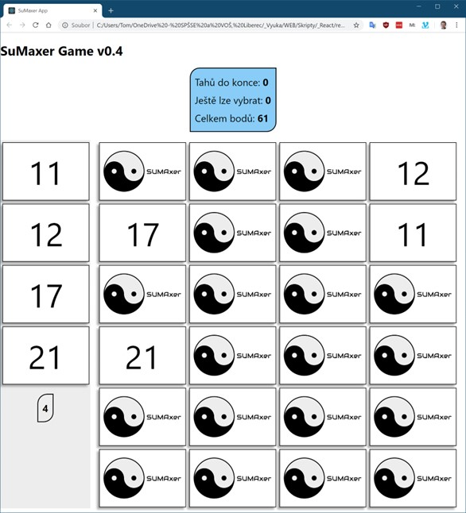

# SUMAxer

Vytvořte jednoduchou hru, jejímž cílem je v zadaném počtu tahů získat co největší počet bodů.

# Pravidla hry

- Každá karta obsahuje unikátní hodnotu na lícové straně (na 24 kartách čísla od 1 do 24)
- Na začátku hry leží všechny karty rubem vzhůru
- V jednu chvíli mohou být otočeny maximálně čtyři karty lícem vzhůru
- Libovolné karty lze opět otočit lícem dolů.
- Hra končí po provedení dvanáctého tahu (Jeden tah = otočení karty lícem vzhůru)
- Body jsou dány součtem hodnot na aktuálně vybraných kartách (otočených lícem vzhůru)

# Návrh herního plánu

Na herní ploše (Desk) jsou „vyskládány" rubem vzhůru (náhodně rozmíchané) jednotlivé karty (Card). Nad nimi je tabulka s herní statistikou (Stats) – počet zbývajících tahů do konce hry; počet karet, které lze otočit lícem vzhůru; počet aktuálně získaných bodů.

Vedle herní plochy je balík (AsideDeck) s kopií právě vybraných karet = otočených lícem vzhůru.

# Herní mechanismy

- Na začátku hry jsou zobrazeny výchozí hodnoty statistik  

- Po zvolení první karty se tato otočí, zobrazí v seznamu vybraných (zde vlevo) a statistiky se aktualizují  

- Pokud jsou vybrány čtyři karty, nelze další otočit  

- Na konci posledního tahu je indikován konec zvýrazněním statistik; s kartami již není možné manipulovat  

# Pravidla

Mezi povolené pomůcky patří například vlastní poznámky a zdroje obecných informací na webu.

# Hodnocení

Hodnotí se nejen funkčnost programu, ale i využití obvyklých konvencí při konstruování kódu.

# Tipy

Vhodnou strukturu pro „mainState" State si vytvoříte:
const initialState = game.initGame();

Obnovit stav hry lze např. odesláním celého mainState do konstruktoru herní třídy:
let hra = new game(mainState);

Metodou hra.Turn(6) realizujete jeden tah – otočení karty s hodnotou 6

Karta je otočena lícem: \<figure className="item selected"\>

Karta je otočena rubem: \<figure className="item"\>

Konec hry lze vizualizovat přidáním třídy endGame: \<aside className="stats endGame"\>
